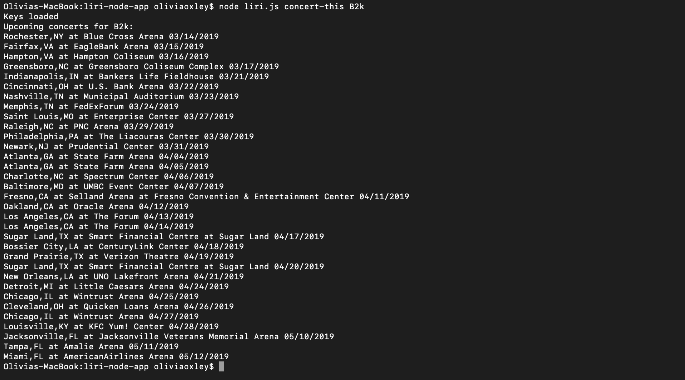
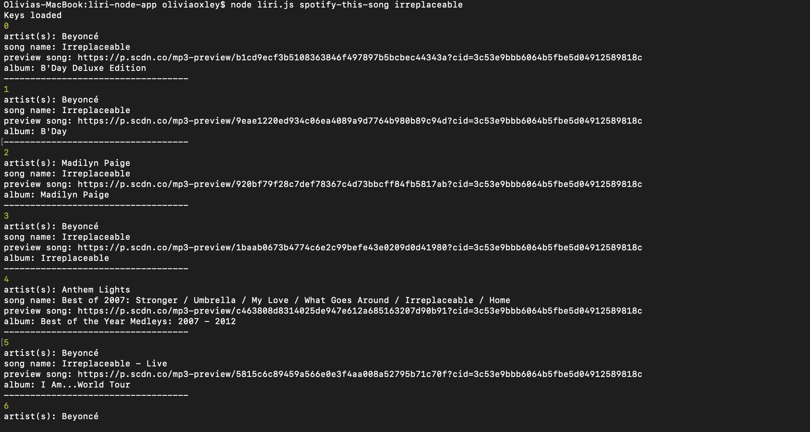
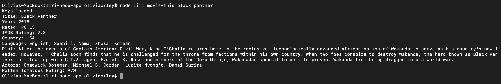
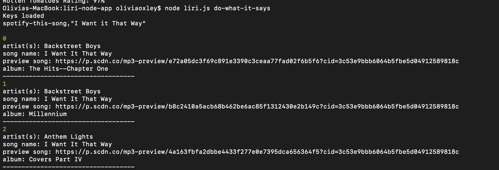

##Liri Node-app

LIRI is like iPhone's SIRI. However, while SIRI is a Speech Interpretation and Recognition Interface, LIRI is a _Language_ Interpretation and Recognition Interface. LIRI will be a command line node app that takes in parameters and gives you back data.

LIRI searches Spotify for songs, Bands in Town for concerts, and OMDB for movies.

 Make it so liri.js can take in one of the following commands:

   * `concert-this`

   * `spotify-this-song`

   * `movie-this`

   * `do-what-it-says`

1. `node liri.js concert-this <artist/band name here>`

 

2. `node liri.js spotify-this-song '<song name here>'`

 

3. `node liri.js movie-this '<movie name here>'`

 

4. `node liri.js do-what-it-says`

 
